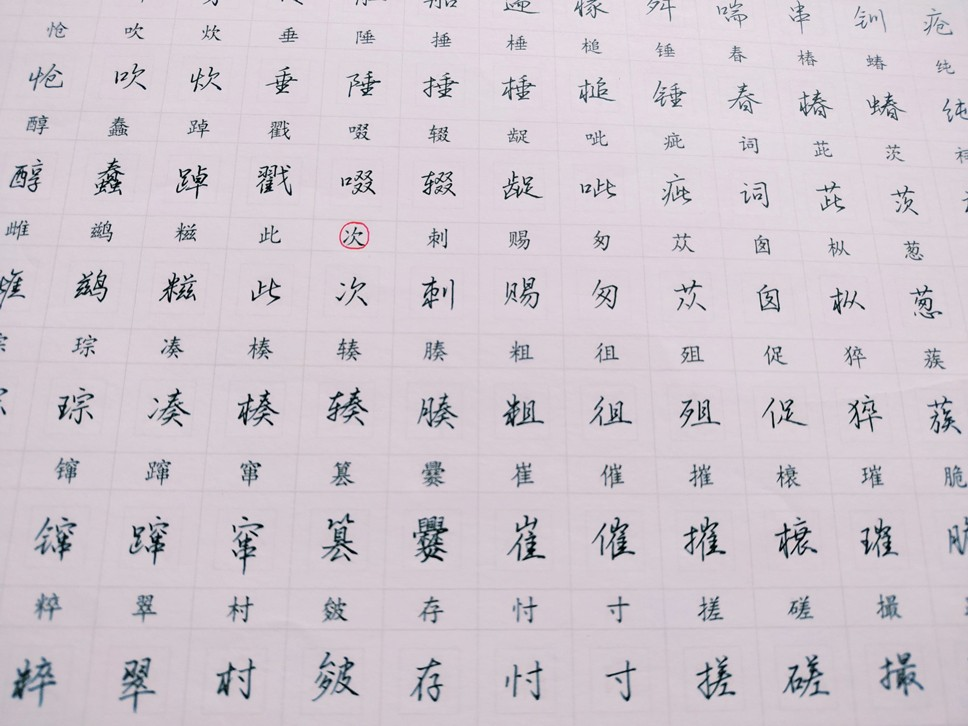
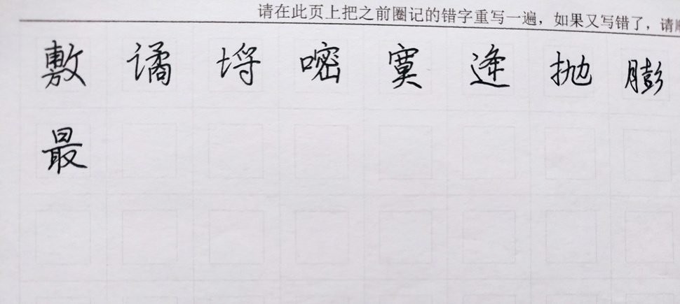
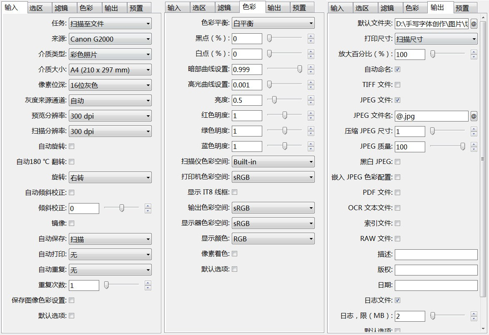

# 手写字稿扫描方法

```
如需交流，请加微信：goodfont（微信加好友，搜索微信名即可）
本教程由做字体网（www.zuoziti.com）友情提供！建议从序言部分开始阅读学习。
```

------

> ### **本节视频教程**

<iframe src="//player.bilibili.com/player.html?aid=559490364&cid=875194776&page=1&high_quality=1&danmaku=0" 
        width="100%" 
        height="400" 
        frameborder="no" 
        scrolling="no" 
        allowfullscreen>
</iframe>

> ### **写完的手写字稿是这样的**

　　前面我们设计好了手写模板，并选好了书写笔，剩下的就是工工整整地书写了，这个过程大约要一个月吧，写得快的也得两个星期，我们要保证质量，人不是机器，累了是需要休息的。

　　如上图所示，就这样认认真真地把字写在模板上，写错的或者写得不满意的就在模板上用红笔圈出来，注意不要圈记到其他字的书写区域。这样比较明显，方便在后面的错字模板上重写错字。

　　如上图所示，在错字模板上，把前面在正式书写模板上标记出来的错字，认认真真重写一遍。  
　　这样我们就把正式模板和错字模板全部写完了，下面我们开始扫描。

> ### **如何设置扫描参数达到最优**

**扫描软件**：扫描图片我用的是这个软件“**VueScan x64**”，这个软件网上有破解版，扫描图片非常的方便。此软件本文文末有提供下载。  
**扫描方法**：扫描分辨率我设置的是300DPI，这个数值大了肯定是清晰一些，但是扫描的速度会慢，得等待很长时间，分辨率大了并不会使得做好的字体效果更优。但如果小了的话会模糊，做成的字体效果会差一些。扫描的像素位深我选择的是16位灰度。这也是我经过大量的实验得出的最优位深，如果是黑白对比度大的话，做出的字体毛刺比较多。下面是我的部分扫描参数设置，大家可以参考一下。  
  

**扫描注意事项**：除了设置上以上最优参数之外，还要尽可能把A4纸在扫描仪中放正当了，最好让A4纸的四个边都可以扫描上，找准这个位置，那剩下的A4都按照这个位置去扫描。还有个别人按照最优参数扫描出来和我上面的图片对比一下是黑乎乎的图片，那就是扫描仪有问题了，你可以自行调整下软件上的对比度、亮度之类的，让它扫描出的和我图片差不多就可以了。  
　　
> ### **扫描的图片重命名**

　　扫描完图片后文件名比较复杂比如“Scan-220519-0001.jpg”，最好再重命名一下，简单点比较好，比如重命名为“01.jpg，02.jpg”等等。  
　　这边要注意一下，有些扫描仪扫面出来是这样命名序号的“1,2,3···10”，这里WINDOWS有个巨大的坑，实际在WINDOWS中是这样排序“1,10,2,3···”，坑爹啊！后面的切图排序必然出错！所以我们要用零补齐位数，最终是这样的“01,02,03···10”！  
  
　　手动或者用软件都可以实现。我这边自己设计了一款批量重命名软件，**批量文件操作**，需要的在本文末下载。软件使用很简单，共有三个功能，批量删除、批量替换、批量添加。这里简单介绍一下，具体的在软件包还有教程。  
   
　　（1）比如把一批图片批量删除里面的一些字符串，把“Scan-220519-0001.jpg”变成“Scan-0001.jpg”，这批图片都有“-220519”，那就可以使用批量删除功能，前面的文本写“-”，后面的文本写“9”即可。如果前面文本或者后面文本中含有多个重复的指定词，那软件会从左往右选择第一次出现的那个指定词。  
　　（2）比如把一批图片批量替换里面的一些字符串，把“Scan-220519-0001.jpg”变成“扫描-0001.jpg”，这批图片都有“Scan-220519”，那就可以使用批量替换功能，替换前写“Scan-220519”，替换后写“扫描”即可。  
　　（3）比如把一批图片的文件名前或后面加一些字符串，把“0001.jpg”变成“220519-0001.jpg”，那就可以使用批量添加功能，选中前或后，填写上指定添加的词即可。 

> ### **下载本文相关软件**

　　本人是一个小白开发者，本人的原则是凡是网上能搜索到的软件本站一律不收费，只有本人原创的一些辅助小软件才酌情收费，本着量贩式的原则用到哪个下载哪个，当然你也可以用其他的一些软件去替代。开发软件很艰难、书写教程很辛苦，希望你能赏我一杯咖啡☕，多谢！  

**VueScan Pro 9.4.19免费下载地址：**https://wwz.lanzouq.com/izzMY051vhxi 访问密码：1bjc  
**批量文件操作下载地址：**https://mbd.pub/o/bread/ZZaUlJ5u  
