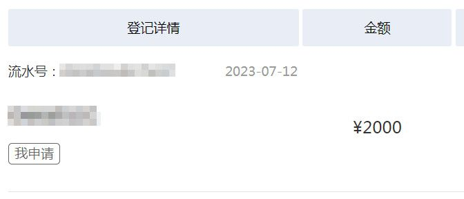
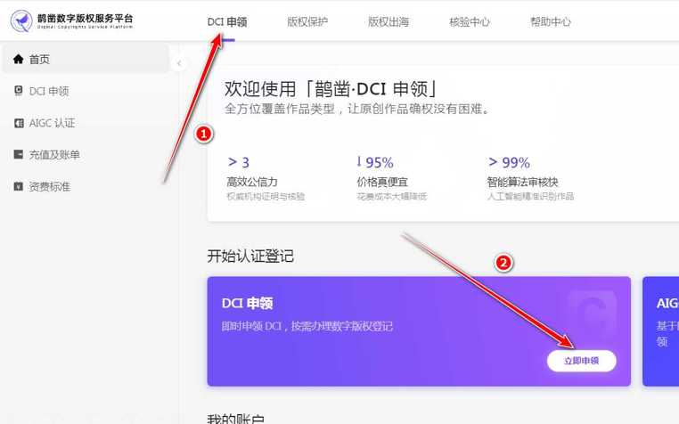
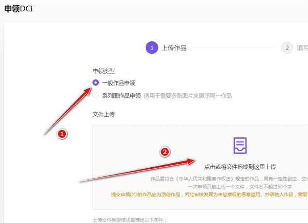
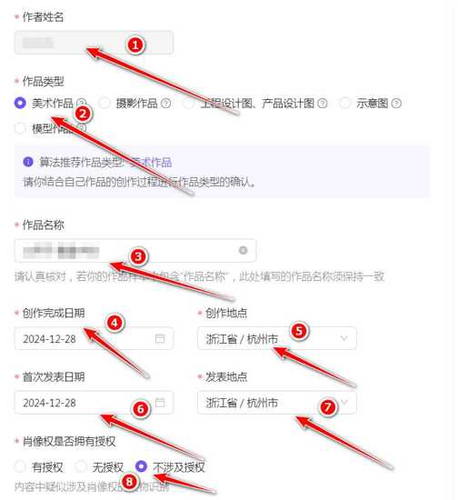
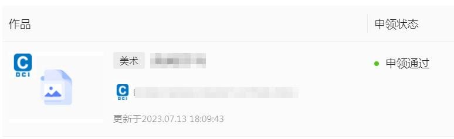

# DCI数字版权登记

```
如需交流，请加微信：goodfont（微信加好友，搜索微信名即可）
本教程由做字体网（www.zuoziti.com）友情提供！建议从序言部分开始阅读学习。
```

------

> ### **本节视频教程**

<iframe src="//player.bilibili.com/player.html?aid=604588084&cid=875272843&page=1&high_quality=1&danmaku=0" 
        width="100%" 
        height="400" 
        frameborder="no" 
        scrolling="no" 
        allowfullscreen>
</iframe>

> ### **什么是DCI数字版权**

  
　　DCI（Digital Copyright Identifier，数字版权唯一标识符），中文名称“数字版权唯一标识符”，用于标识和描述数字网络环境下权利人与作品之间一一对应的版权权属关系。  
　　我的理解是，上一节讲的区块链存证是民间的，是区块链公司颁发的；而DCI数字版权是官方的正式的，是国家版权局颁发的。两者都有法律效力，DCI数字版权效力更高一些吧，而在具体的举证中区块链存证则有更直观强大的举证能力。  

> ### **在美素版权平台免费获得DCI数字版权证书**

　　<font color="red">此免费方法已经失效，请看下面的方法。此方法仅作存档用。</font>   
　　<del>DCI数字版权可以直接去国家、各省市的版权局登记，应该是收费的，很早的时候申请过一次，100元一件，现在多少钱就不清楚了。出证时间都很慢，少则一星期多则一个月才能出证吧，可能连纸质证书一起出来。  
　　网上也有一些第三方登记机构直接对接的国家版权局，这个途径最好了，有收费的也有免费的。我找到一个最好的[**美素版权**](http://www.meisubq.com/)，完全免费，超赞！关于注册认证之类的本站就不罗嗦了，自行解决吧，我为大家具体讲讲如何免费登记。</del>  

<del>1. 登录[**美素版权**](http://www.meisubq.com/)，点击顶部导航栏“**版权服务**”，然后在页面中选择美术作品，点击“**立即供图**”。</del>  
     
<del>2. 点击大大的加号上传图片。图片格式仅限JPG、PNG，不低于400万像素，最大20M。</del>  
     
<del>3. 杂项设置。作品类型选择“**字体**”；作品名称会根据所上传的图片名**自动填写**，一般不用管；不管字体发表不发表的一律写**已发表**，只有发表了才有版权登记的必要吧，没有发表自己存着还登记什么呢？完成时间和首次发表时间自己大胆填写即可。创作说明这个要重点写啊，写的不好要被打回的。**你要把你的字体独特之处写出来，越与众不同越能突出个性越好，字数大约300字足够了**。内容分类选择“**符号及标志**”。</del>  
     
<del>4. 提交之后剩下的就是苦等了，快的时候一个星期出结果，慢的时候可能得半月二十天了。可以在自己手机上设置一个日程，提醒自己去看看有没有出结果，别忘记了。</del>   

> ### **在鹊凿数字版权服务平台获得国家级DCI数字版权证书**

　　上面的美素版权失效了，于是我就尝试着与国家版权登机门户[**中国版权保护中心**](https://www.ccopyright.com.cn/)联系，这可是最权威的平台了，通过打电话沟通得到的结果是他们正在改版，已经取消了跟其他第三方的合作，那这样看来像美素版权这种对接中国版权保护中心的平台全部失效了。   
　　于是，我只能去[**中国版权保护中心**](https://www.ccopyright.com.cn/)登记DCI了，天啊打劫，2000元/份，血贵！血贵！最终还是放弃了。
     
　　通过研究美素版权的新的对接方式，我发现它对接的是蚂蚁链，于是我追根溯源，找到蚂蚁链的版权保护官网[**鹊凿数字版权服务平台**](https://www.mydcs.com/)，那就直接用官网吧。蚂蚁链属于蚂蚁集团，而蚂蚁集团又属于阿里巴巴集团旗下的金融科技子公司。那这样就比较靠谱了。   
　　字体DCI版权属于美术类，经过踩了各种坑，我总结了一下它的申领方法。需要把我们的字体文件导出为图片格式，之前我们是把字形全部拼接到一张长图上去申请登记，这种方式是不允许的。它的要求是“<font color="red">需要将多张图片（不低于400X400像素，不高于5000X5000像素）合成为一个文件后进行上传。须包含的图片数量为2-30张，合成后图片需清晰可见，不带边框。</font>”   
　　**一、字体字形转图片文件**   
　　总体思路是：先在WORD中把我们字体中包含的所有字符显示出来，然后导出为文字式PDF文件。然后再把PDF文件转成图片格式的文件。可以用工具比如“PDF Candy”（文末有免费下载地址）导出为单张的图片，然后再用这个工具把所有导出的图片合并成一个图片，注意图片要横向并排，不能全部是竖排的，全部竖排的就会使图片太长了，要调成上面提到的文件大小、图片数量和清晰度要求，再上传这个图片即可。   
　　当然懒人还是有懒办法，我写了一款小工具，图省事，可以直接把字体中的字形导出为图片并压缩优化到平台需要的清晰度和尺寸。如下图所示，有需要的可以下载使用。   
     
   **二、申领系列图作品的DCI**   
   0、注册认证什么的我就不罗嗦了，可以直接用支付宝登录，官网在这里[**鹊凿数字版权服务平台**](https://www.mydcs.com/)。首次注册会赠送100元体验金（如果自己新注册账号中没有体验金，请联系本文下方的钉钉群找他们官方管理员要。）可以免费申领20个字体类的美术DCI版权，如果你没有特别多的申领需求，这20个也足够了。超出20个就要收费了，5元/个，相比中国版权保护中心的2000元/个，这是超级亲民的白菜价格了。超赞！   
   1、登录之后点击顶部导航栏“DCI申领”，再点击“立即申领”。   
     
   2、选择申领类型为“一般作品申领”，然后上传上面我们做好的图片文件。点击“下一步”会进入人工智能审核步骤，如果图片清晰度尚可，尺寸及文件大小都合规就可以进行下一步了。   
     
   3、作者姓名就是你认证的不能修改，作品类型选美术作品，作品名称、创作完成日期、创作地点、首次发表日期、发表地点等自己填上即可，肖像权选不涉及授权，下面四个钩全部打上。然后“马上申领”，前20个是免费的，体验金自动扣除，超过就要收费了，支付5元/个。   
     
   4、提交之后会再次经过机器智能审核查重，由于我们做的是字体类的，而字体又大部分相似、创新不够，这时候有可能被系统判定为雷同作品或者里面的文字有敏感信息，导致申领失败。不要担心，我们进入到“我的工作台→作品认证登记”，这里会显示我们已提交的全部作品，只需在申领失败的作品上点击一下申诉，然后等几个小时会有申诉结果，多数是申领成功的。   
     
   5、如果还是申领失败，请联系鹊凿的官方人员，钉钉群号是：20965021986，群里面的群主及管理员都可以帮我们重新提交到人工审核，他们的响应还是比较迅速的，一般都是可以申领通过的。祝大家好远！

> ### **下载本文相关软件**

　　本人是一个小白开发者，本人的原则是凡是网上能搜索到的软件本站一律不收费，只有本人原创的一些辅助小软件才酌情收费，本着量贩式的原则用到哪个下载哪个，当然你也可以用其他的一些软件去替代。开发软件很艰难、书写教程很辛苦，希望你能赏我一杯咖啡☕，多谢！  

**PDF Candy Desktop v2.8.0 绿色便携版免费下载：**<font color="red">注意文件比较大，所以做了压缩分卷，另外蓝奏云网盘不让上传.z01分卷格式，所以临时改成了.pdf。现在需要做的就是把压缩分卷一和二下载完，只改压缩分卷一的格式后缀.pdf改成.z01，压缩分卷二保持不动，然后解压任意一个文件即可。</font>   
**压缩分卷一：**https://wwno.lanzouj.com/iRfeY12cjbgh   密码:7vmz（下载完后请把格式后缀.pdf改为.z01）   
**压缩分卷二：**https://wwno.lanzouj.com/i7v5512cje1a   密码:hwdq（下载完后保持文件名不动）   
**一键把字形转成图片下载：**https://mbd.pub/o/bread/ZZaUlZZv