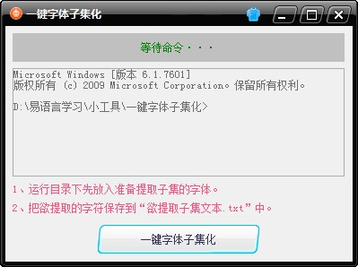

# 字体子集化

```
如需交流，请加微信：goodfont（微信加好友，搜索微信名即可）
本教程由做字体网（www.zuoziti.com）友情提供！建议从序言部分开始阅读学习。
```

------

> ### **什么是字体子集**

　　字体子集，就是从一个大字体中分离出的多个独立的子集字体。比如我们要简化一个别人的字体，从他的字体中分离自己想要的字。又比如说我们要在网站上展示一些手写符号，为了优化网站加载速度，web字体需要做的很小，里面仅仅包含了几十甚至几个字符，这也得用到字体子集化这个功能。比如下面这个网站web字体只有寥寥几个字（图形）。   
　　    

> ### **字体子集化方法-手动方法**

　　前面教程已经教大家安装了python和fonttools这两个免费工具，这次我们就是利用fonttools中的pyftsubset命令进行字体子集化。如果你还没有安装python和fonttools，请先看我前面的教程：[**批量筛选超标字符**](http://www.zuoziti.com/#/screen)。   
　　pyftsubset字体子集化有两种方法，下面一一介绍。先在字体所在目录空白处按住Shift键的同时点击鼠标右键，选择打开“在此处打开命令窗口”。这是win7的显示，win10会显示打开Windows PowerShell窗口。一样能用。   
　　   
　　**方法一：**输入以下命令回车即可把“我的第一个字体.ttf”这个字体文件中的汉字“一二三”这三个字符提取出来并保存为新字体“提取的.ttf”。“一二三”这几个字要提前转换为对应的Unicode，每个字符用英文逗号隔开。   

```
pyftsubset 我的第一个字体.ttf --unicodes="U+4e00,U+4e8c,U+4e09" --output-file="提取的.ttf"
```

　　上面的命令执行完毕即可生成"提取的.ttf"。如下图所示。   
　　    
　　**方法二：**输入以下命令回车也能达到方法一的效果。区别就是方法一是在CMD执行窗口中指定字符的Unicode，因窗口命令中有字符数量的限制，所以这种方法适合字数比较少的情况。方法二是用文本文件指定字符的方式，字数限制多少没做研究，反正6700多字是可以一次性取出的。方法二需要先在字体同目录下新建一个“指定字符.txt”，里面保存上你要取出的字符的Unicode，一行一个，不留空格和空行。如图所示。   
　　   

```
pyftsubset 我的第一个字体.ttf --unicodes-file="指定字符.txt" --output-file="提取的.ttf"
```
　　上面的命令执行完毕即可生成"提取的.ttf"。   

> ### **字体子集化方法-自动方法**

　　    
　　我自己编写的一键字体子集化小软件，此软件可以借助Python把TTF字体文件分离出自己需要的字符并重新组合为新字体，简单、省时省力，如需要请下载使用，前提是安装了Python和fonttools。

> ### **下载本文相关软件**

　　本人是一个小白开发者，本人的原则是凡是网上能搜索到的软件本站一律不收费，只有本人原创的一些辅助小软件才酌情收费，本着量贩式的原则用到哪个下载哪个，当然你也可以用其他的一些软件去替代。开发软件很艰难、书写教程很辛苦，希望你能赏我一杯咖啡?，多谢！

**一键字体子集化下载：**https://mbd.pub/o/bread/Zpeck5ht