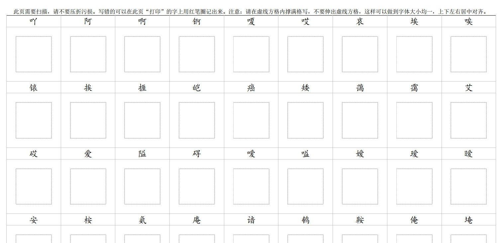
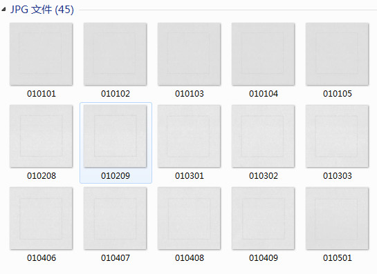

# 小楷字库的制作

```
如需交流，请加微信：goodfont（微信加好友，搜索微信名即可）
本教程由做字体网（www.zuoziti.com）友情提供！建议从序言部分开始阅读学习。
```

------

> ### **小楷字库手写模板定制**

　　前面我详细地介绍了如何制作用钢笔或中性笔写的字体，相信大家已经做好了自己的第一套字体。后来与网友的交流中发现，学习做字体的人中还有好多是书法爱好者，他们写一手好字，尤其擅长写小楷。那这样制作小楷字库的工作也便提上日程了。  
　　那首先要做的就是小楷字库手写模板的设计，由于还要扫描还是用A4纸比较方便，格子要设计的大一些，网友推荐的最优大小是2.0X2.0厘米的，后来也有网友推荐1.5X1.5厘米的，这样就需要把之前的模板规则全部推翻重新设计。啊！好痛苦啊，重新搞，将近7000字，要让每个字位于不同的格子里面，手工制作的话累死吧，幸亏还会点编程三脚猫功夫，最终设计好后是154页A4纸。即便是用程序实现，但也由于页码太多OFFICE WORD卡的要命，还是会经常出错。   
　　最后经过手工排查，确定无误了，网友们可以去本文末下载使用了（<font color="red">注意：本次提供的是PDF文件，打印的时候不要缩放，不要缩放，不要缩放！用喷墨打印机打印，因为需要打印出灰色格子。</font>）。如下图所示。
　　   

> ### **批量水平矫正大图并裁切成小图片软件定制**

　　手写稿模板格子大小改变了，那批量矫正大图并裁切成小图片这个软件的参数也要相应的调整了，又是一件非常痛苦的事，之前的参数调好了之后我就再也不愿意碰它了。由于图片水平矫正是非常精细的活，即使是几个像素的误差都会影响到切图的精度，而这个误差会随着切图数量的增加不断增加，到最后就可能惨不忍睹了。真是“差之毫厘谬以千里”啊！   
　　    
　　最后调好参数，切图还是很完美的，如下图所示，非常精准，当然还要扫描的时候放的尽可能正当才可以啊。   
　　   
　　其他的流程就和钢笔字体的制作是一样的，大家可以结合前面的教程进行制作。祝大家好运！

> ### **下载本文相关软件**

　　本人是一个小白开发者，本人的原则是凡是网上能搜索到的软件本站一律不收费，只有本人原创的一些辅助小软件才酌情收费，本着量贩式的原则用到哪个下载哪个，当然你也可以用其他的一些软件去替代。开发软件很艰难、书写教程很辛苦，希望你能赏我一杯咖啡☕，多谢！  

**小楷字库手写模板_1.5CM免费下载地址：**https://wwno.lanzouj.com/iJZRA17b5yed 密码:d7dq  
**小楷字库手写模板_2.0CM免费下载地址：**https://wwno.lanzouj.com/it8Xp17b6bxa 密码:b9wk   
**批量水平矫正大图并裁切成小图片_小楷字库_1.5CM下载地址：**https://mbd.pub/o/bread/ZZaUlZdr     
**批量水平矫正大图并裁切成小图片_小楷字库_2.0CM下载地址：**https://mbd.pub/o/bread/ZZaUlZdv     